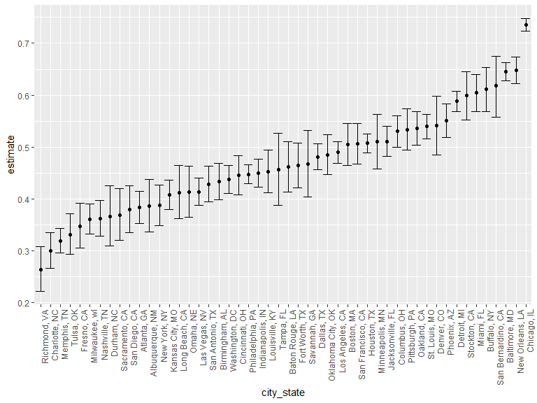

p8105_hw5_mgw2144
================
2023-11-08

``` r
library(tidyverse)
library(rvest)

knitr::opts_chunk$set(
  fig.width = 8,
  fig.height = 6,
  out.width = "90%"
)

options(
  ggplot2.continuous.colour = "viridis",
  ggplot2.continuous.fill = ("viridis"))

scale_colour_discrete = scale_colour_viridis_d
scale_fill_discrete = scale_fill_viridis_d
```

# Problem 1

``` r
homicide_df = 
  read_csv("data/homicide-data.csv", na = c("", "NA", "Unknown")) %>%
  mutate(
    city_state = str_c(city, state, sep = ", "),
    resolution = case_when(
      disposition == "Closed without arrest" ~ "unsolved",
      disposition == "Open/No arrest"        ~ "unsolved",
      disposition == "Closed by arrest"      ~ "solved"
    )
  ) %>% 
  filter(city_state != "Tulsa, AL") 
```

    ## Rows: 52179 Columns: 12
    ## ── Column specification ────────────────────────────────────────────────────────
    ## Delimiter: ","
    ## chr (8): uid, victim_last, victim_first, victim_race, victim_sex, city, stat...
    ## dbl (4): reported_date, victim_age, lat, lon
    ## 
    ## ℹ Use `spec()` to retrieve the full column specification for this data.
    ## ℹ Specify the column types or set `show_col_types = FALSE` to quiet this message.

The resulting dataframe has 52178 entries, on variables that include the
victim name, race, age, and sex; the date the homicide was reported; and
the location of the homicide. In cleaning, I created a `city_state`
variable that includes both city and state, and a `resolution` variable
to indicate whether the case was closed by arrest. I also excluded one
entry in Tulsa, AL, which is not a major US city and is most likely a
data entry error.

In the next code chunk, I group within cities and summarize to produce
the total number of homicides and the number that are solved.

``` r
city_homicide_df = 
  homicide_df %>% 
  select(city_state, disposition, resolution) %>% 
  group_by(city_state) %>% 
  summarize(
    hom_total = n(),
    hom_unsolved = sum(resolution == "unsolved"))
```

Focusing only on Baltimore, MD, I can use the `prop.test` and
`broom::tidy` functions to obtain an estimate and CI of the proportion
of unsolved homicides in that city. The table below shows those values.

``` r
bmore_test = 
  prop.test(
    x = filter(city_homicide_df, city_state == "Baltimore, MD") %>% pull(hom_unsolved),
    n = filter(city_homicide_df, city_state == "Baltimore, MD") %>% pull(hom_total)) 

broom::tidy(bmore_test) %>% 
  knitr::kable(digits = 3)
```

| estimate | statistic | p.value | parameter | conf.low | conf.high | method                                               | alternative |
|---------:|----------:|--------:|----------:|---------:|----------:|:-----------------------------------------------------|:------------|
|    0.646 |   239.011 |       0 |         1 |    0.628 |     0.663 | 1-sample proportions test with continuity correction | two.sided   |

Building on this code, I can use functions in the `purrr` package to
obtain estimates and CIs for the proportion of unsolved homicides in
each city in my dataset. The code below implements this analysis.

``` r
test_results = 
  city_homicide_df %>% 
  mutate(
    prop_tests = map2(hom_unsolved, hom_total, \(x, y) prop.test(x = x, n = y)),
    tidy_tests = map(prop_tests, broom::tidy)) %>% 
  select(-prop_tests) %>% 
  unnest(tidy_tests) %>% 
  select(city_state, estimate, conf.low, conf.high) %>% 
  mutate(city_state = fct_reorder(city_state, estimate))
```

Finally, I make a plot showing the estimate (and CI) of the proportion
of unsolved homicides in each city.

``` r
test_results %>% 
  mutate(city_state = fct_reorder(city_state, estimate)) %>% 
  ggplot(aes(x = city_state, y = estimate)) + 
  geom_point() + 
  geom_errorbar(aes(ymin = conf.low, ymax = conf.high)) + 
  theme(axis.text.x = element_text(angle = 90, hjust = 1))
```



This figure suggests a very wide range in the rate at which homicides
are solved – Chicago is noticeably high and, given the narrowness of the
CI, likely is the location of many homicides.

# Problem 2

## Reading the data and creating a dataframe with the map function

``` r
study_data = 
  tibble(
    files = list.files('data/study_data'),
    path = str_c("data/study_data/", files)
  ) %>% 
  mutate(data = map(path, read_csv)) %>% 
  unnest() 
```

## Tidying the data

``` r
study_data_tidy = 
  study_data %>% 
  separate(files, into = c("control_arm", "subject_ID", "csv")) %>% 
  mutate(
    control_arm = ifelse(control_arm == "con", "control", control_arm),
    control_arm = ifelse(control_arm == "exp", "experimental", control_arm)
  ) %>% 
  pivot_longer(
    cols = starts_with("week"),
    names_prefix = "week_",
    names_to = "week_number",
    values_to = "observation"
  ) %>% 
  mutate(
     week_number = as.numeric(week_number)) %>% 
  select(control_arm, subject_ID, week_number, observation)
```

## Plotting the tidy data

``` r
study_plot = 
  study_data_tidy %>% 
  ggplot(aes(x = week_number, y = observation, colour = subject_ID)) +
  geom_point() +
  geom_line() +
  facet_grid(.~control_arm) +
  labs(
    x = "Week",
    y = "Observation", 
    title = "Observations by week for each subject in both control arms" 
  )

study_plot
```


The control arm appears to have observations steadily between the range
of approximately -2.3 and 4.3 for all 8 weeks and for all 10 subjects
with the lowest observation value seen in week 6 for subject 5 and the
highest observation value seen in week 5 for subject 10. The
experimental arm shows a steady positive/increasing trend for the
observations values in all subjects across the 8 week period. The lowest
observation value for the experimental arm was in subject 1 in week 1,
and the highest observational value was in week 9 for subject 5. This
indicates a positive relationship between observation value and week
(time) in the experimental arm that we do not see in the control arm.

# Problem 3

## Creating function and map

``` r
sim_function = function(n = 30, mu_val = c(0, 1, 2, 3, 4, 5, 6), sigma = 5, alpha = 0.05, num_datasets = 5000) {
  
  results = map_df(mu_val, function(mu) {
    
    datasets = replicate(num_datasets, rnorm(n, mean = mu, sd = sigma), simplify = FALSE)
    
    map_df(datasets, function(dataset) {
      t_test_result = t.test(dataset, mu = mu)
      tidy_results = broom::tidy(t_test_result)
      data.frame(mu = mu, mu_est = tidy_results$estimate, p_value = tidy_results$p.value)
    })
  })
  
  return(results)
}

result_df = sim_function()
```

## Plot 1: Power vs. True Mean

``` r
plot_1_df =
  result_df %>%
  group_by(mu) %>%
  summarise(power = mean(p_value < 0.05))

plot_1=
ggplot(plot_1_df, aes(x = mu, y = power)) +
  geom_line() +
  geom_point() +
  labs(
    x = "True mu value",
    y = "Power of the Test",
    title = "Association between effect size and power"
  )

plot_1
```


There appears to be a non-linear association between effect size and
power based on the graph. Each time that we run the simulated data the
graph appears different, with a non-linear association each time.

## Plot 2: Average estimate of mu hat compared to true mu value

``` r
plot_2_df =
result_df %>%
  group_by(mu) %>%
  summarise(avg_mu_hat = mean(mu_est))
  
plot_2 = 
  plot_2_df %>% 
  ggplot(aes(x = mu, y = avg_mu_hat)) +
  geom_point()+
  geom_line()+
  labs(
    title = "Average estiamte of mu hat vs. the true mu value",
    x = "True mu value",
    y = "Estimated mu value"
  )

plot_2
```


There is a very strong positive linear relationship between the true mu
values and the average estimated mu values created from the simulation.
This makes sense as when we run a higher number of samples, our average
estimated means will mimic the true mean value.

## Plot 3: Avergate estimate of mu in samples where the null is rejected compared to the true mean value

``` r
plot_3_df = 
  result_df %>%
  filter(p_value < 0.05) %>%
  group_by(mu) %>%
  summarise(avg_mu_hat_rej = mean(mu_est))

plot_3 =
  ggplot() +
  geom_line(data = plot_2_df, aes(x = mu, y = avg_mu_hat), color = "green")+
  geom_point(data = plot_2_df, aes(x = mu, y = avg_mu_hat), color = "green")+
  geom_line(data = plot_3_df, aes(x = mu, y = avg_mu_hat_rej), color = "blue") +
  geom_point(data = plot_3_df, aes(x = mu, y = avg_mu_hat_rej), color = "blue") +
  labs(
    x = "True value of mu",
    y = "Average estimate of mu",
    title = "Average estimate of mu for samples where null hypothesis was rejected"
  )

plot_3
```


The sample average of mu hat across tests for which the null is rejected
is approximately equal to the true value of mu. As we run more samples,
the average values of the estimated mus more closely approximates the
true mu values. The differences seen in the graph is due to random
sampling variability in the results.
